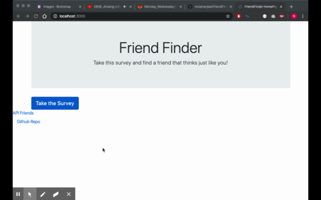

# FriendFinder
This is a full stack site that matches users based on similarities in survey answers. The purpose of FriendFinder is to demonstrate the use of a Node Express server and the dynamic creation of a backend API. Additionally, the file set up of this application exhibits an MVC paradigm with a separation of concerns between the front-end and back-end functions and organization. 

## Application Demonstration
Users interact with this application by taking the survey presented to them; then the application will display to the user their best match based upon the least absolute difference between each of the survey answers as compared to other users in the database. 

## Technologies Used 
* HTML 
* CSS and Bootstrap 
* JQuery and Javascript 
* Node 
* Express Server 

## Future Application Developments 
In the future, I would like to improve upon this application's user experience and design using CSS and possibly Sass. This application is at it's basic level right now solely for the purposes of demonstrating the use of the Node Express server. 
